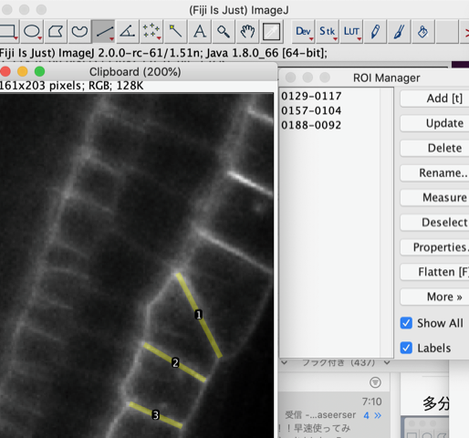
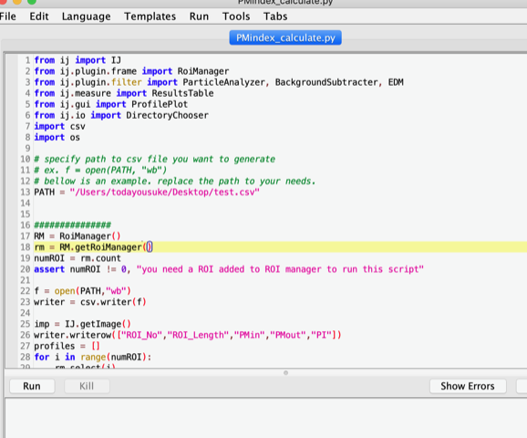
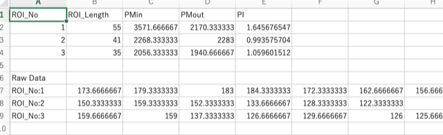

# Polarity_Index_Calculator
 a script to calculate polarity index that runs in jython of fiji

## Usage

1. Open Fiji and open your image of interest.

   

2. Register Straight Line ROIs along the cell wall. Line width are preferably 3px width, but depends on your cell wall thickness of your image.

2. Select "Open" command from the "Menu" bar. Select **pm_index.py** and open. A script editor like the bellow image will open.

   

3. Line PATH = "/Users/XXXXXXXXXXXXXX" is the path of the analyzed csv file is to be saved. Define your own path.

4. Press RUN. A CSV file will be generated according to your defined PATH.

   

